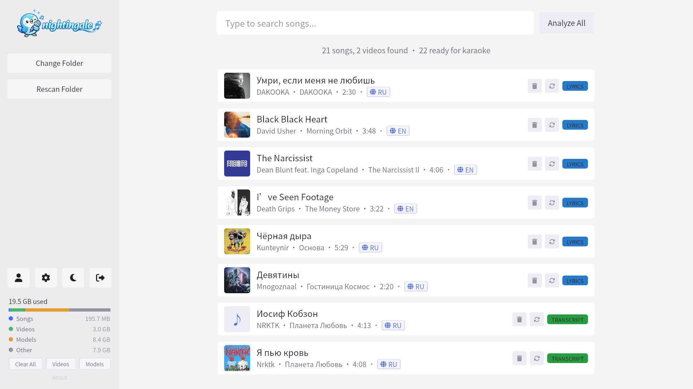

# Configuration

Nightingale stores app settings in `~/.nightingale/config.json`.

## Data Storage

During setup, you can choose a custom data folder. Most runtime data lives in that selected folder. `config.json` and `nightingale.log` remain in the default `~/.nightingale` path.

Typical selected data folder layout:

```
<selected-data-folder>/
├── cache/               # Stems, transcripts, lyrics, shifted variants, covers, playable videos
├── songs.db             # Song library and analysis metadata (SQLite)
├── profiles.json        # Player profiles and scores
├── videos/              # Cached Pixabay video backgrounds
├── sounds/              # Sound effects
├── vendor/
│   ├── ffmpeg           # Downloaded ffmpeg binary
│   ├── uv               # Downloaded uv binary
│   ├── python/          # Python 3.10 installed via uv
│   ├── venv/            # Virtual environment with ML packages
│   ├── analyzer/        # Extracted analyzer Python scripts
│   └── .ready           # Marker indicating setup is complete
└── models/
    ├── torch/           # Demucs model cache
    ├── huggingface/     # WhisperX model cache
    └── audio_separator/ # UVR Karaoke model cache
```

## Video Backgrounds

Pixabay video backgrounds use the [Pixabay API](https://pixabay.com/api/docs/). In development, create a `.env` file at the project root with:

```
PIXABAY_API_KEY=your_key_here
```

## Theme

Toggle between dark and light themes from the sidebar. The theme preference is saved in the config.



## Notable Settings

`config.json` is written by the app — you'll usually change these from **Settings** rather than by editing the file directly. A few keys worth knowing:

| Key | Purpose |
|---|---|
| `asr_engine` | Selects the transcription engine. `whisper` (default) or `parakeet`. See [Lyrics & Transcription](./lyrics.md#choosing-the-asr-engine). |
| `separator` | Stem separation model: `karaoke` (UVR, default) or `demucs`. |
| `whisper_model` | Whisper model size: `large-v3` (default), `large-v3-turbo`, `medium`, `small`, `base`, `tiny`. Ignored when `asr_engine` is `parakeet`. |
| `beam_size` / `batch_size` | Decoder beam width and batch size for Whisper. Higher values are more accurate but slower and use more VRAM. |
| `mic_mirror_gain` | Live monitor gain when mic mirroring is on. Range `0.0`–`2.0` (slider shown as 0–200%). |
| `mic_active` / `mic_mirroring` / `preferred_mic` | Microphone state and the device chosen for scoring + mirroring. |
| `last_video_flavor` | Index of the last-used Pixabay video flavor (Nature, Underwater, Space, City, Countryside). |
| `last_theme` | Index of the last-used playback background (shaders → video → source). |
| `language_overrides` | Per-song forced ASR language, keyed by song hash. Set this from the song-list controls. |
| `data_path` | Selected data folder root. Set during first-run setup. |
